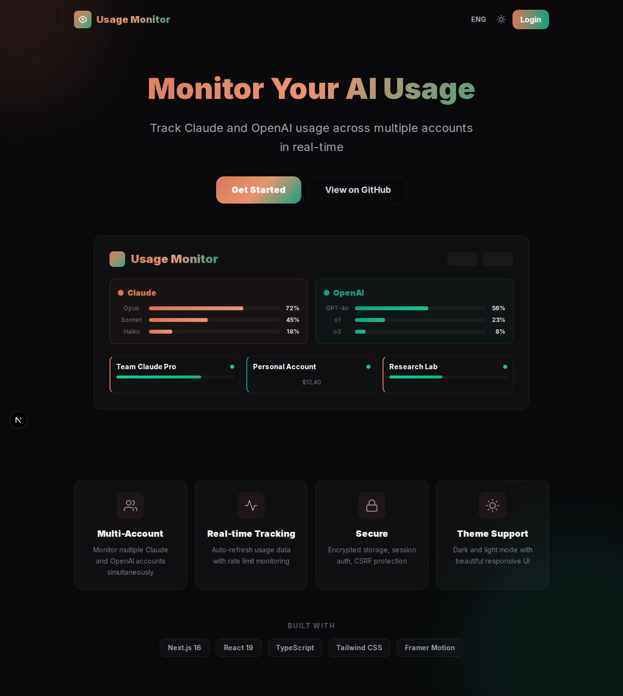
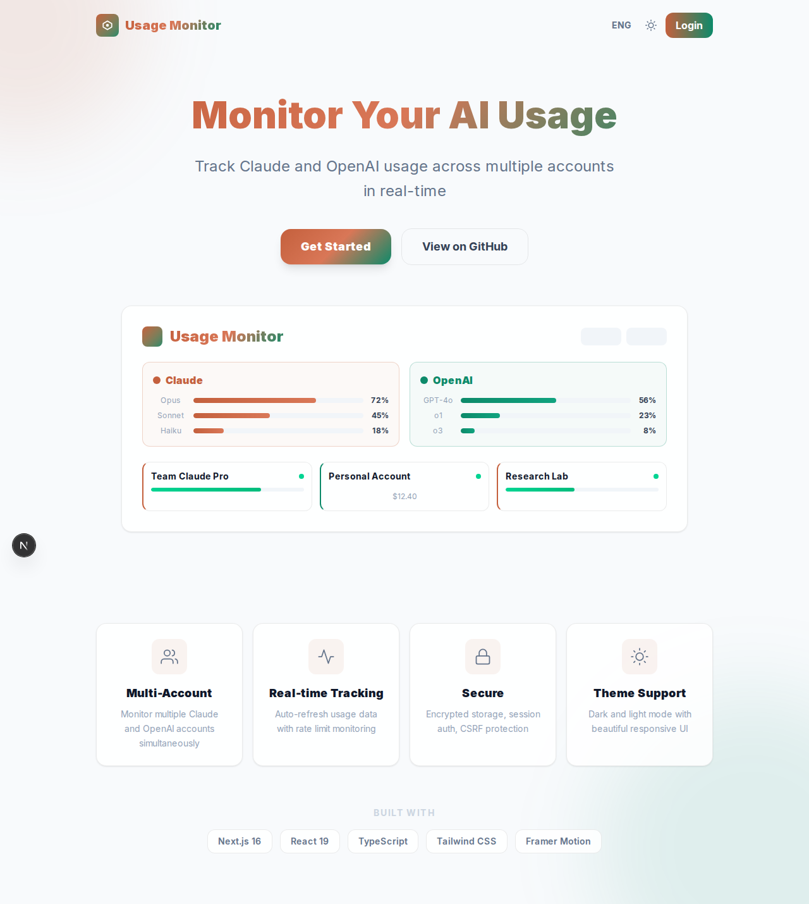
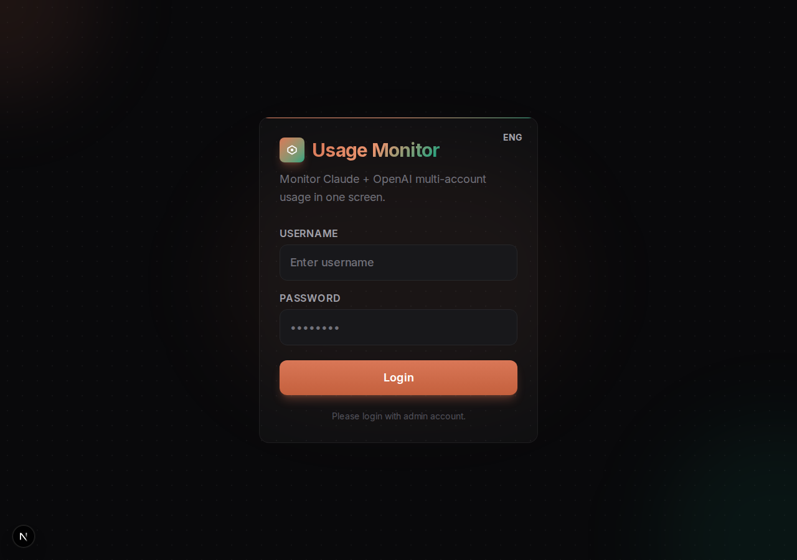
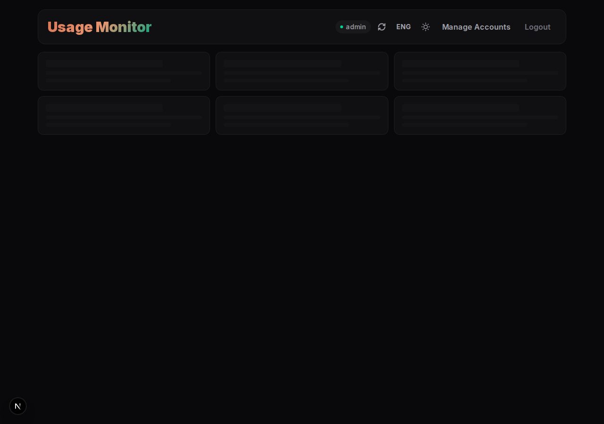
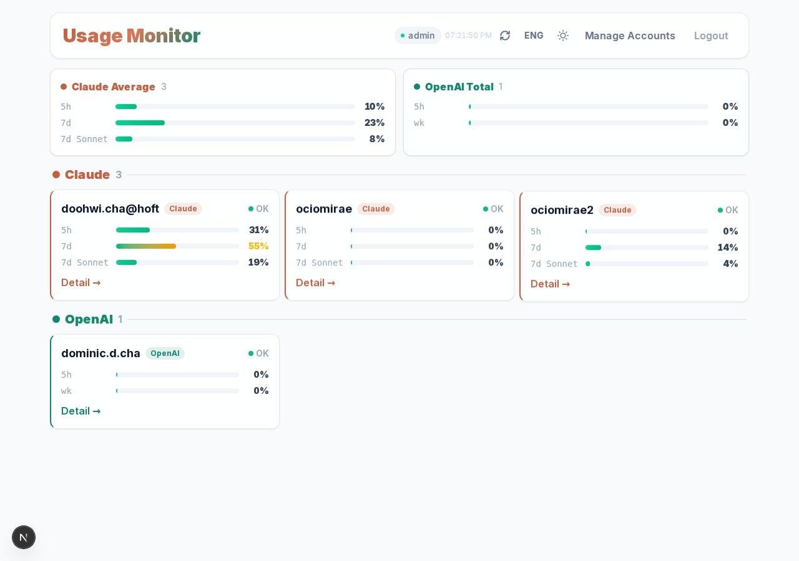
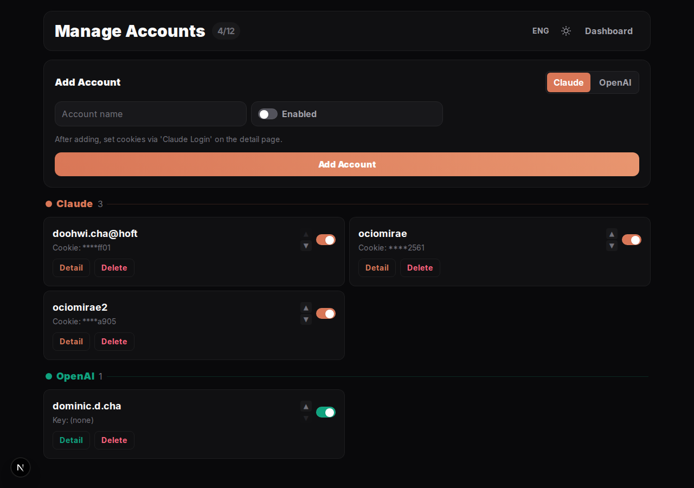
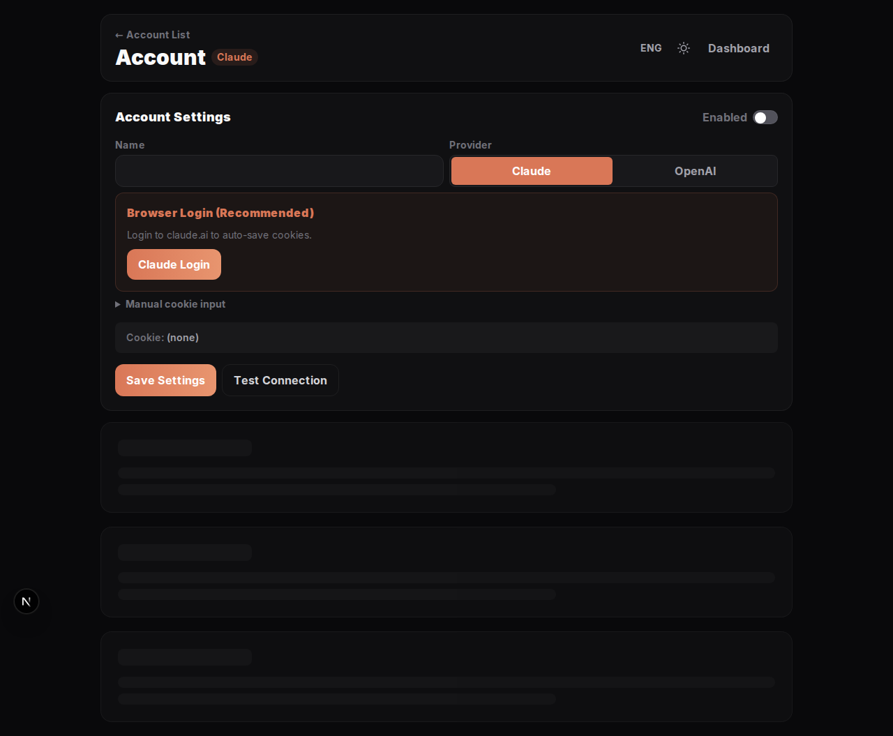
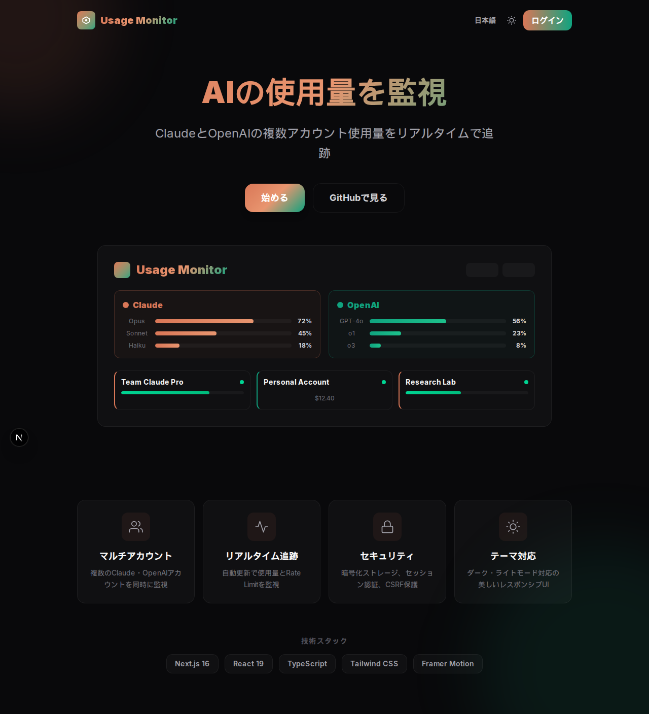

# Usage Monitor

Monitor **Claude** and **OpenAI** multi-account usage in a single dashboard.

Built with Next.js 16, React 19, TypeScript, Tailwind CSS v4, and Framer Motion.



---

## Features

- **Multi-Account Support** — Monitor up to 12 Claude and OpenAI accounts simultaneously
- **Real-time Usage Tracking** — Auto-refresh every 60 seconds with background updates
- **Rate Limit Monitoring** — Visualize Claude usage windows (5h, 7d) with progress bars
- **Browser Login** — One-click Claude login via Playwright (auto-saves cookies) plus ChatGPT subscription import for OpenAI accounts
- **Multi-User Auth** — Scrypt-hashed passwords, role-based access (admin/viewer), server-side sessions
- **Dark / Light Theme** — Beautiful glass-morphism UI with theme toggle
- **6 Languages** — English, Korean, Japanese, Chinese, Spanish, Portuguese
- **Secure** — AES-256-GCM encryption, SQLite-backed sessions, CSRF protection, CSP headers, audit logging

---

## Screenshots

### Landing Page

Service introduction with dashboard preview mockup.

| Dark | Light |
|------|-------|
|  |  |

### Login

Admin authentication with gradient brand styling.



### Dashboard

Real-time usage overview with provider grouping and utilization bars.

| Dark | Light |
|------|-------|
|  |  |

### Account Management

Add, reorder, enable/disable, and delete accounts.



### Account Detail

Per-account settings, browser login, connection testing, and daily usage table.



### Internationalization

All UI text is translated. Example in Japanese:



---

## Getting Started

### Prerequisites

- **Node.js** 20+
- **npm** 10+
- (Optional) **Playwright** for browser-based login

### Installation

```bash
git clone https://github.com/DoohwiCha/usage-monitor.git
cd usage-monitor
npm install
```

### Environment Variables

Copy the example file and configure:

```bash
cp .env.example .env.local
```

| Variable | Description | Required |
|----------|-------------|----------|
| `MONITOR_ADMIN_USER` | Initial admin username | **Yes** |
| `MONITOR_ADMIN_PASS` | Initial admin password (min 8 chars) | **Yes** |
| `MONITOR_ENCRYPTION_KEY` | 64-char hex key for AES-256-GCM (use `openssl rand -hex 32`) | **Yes** |
| `MONITOR_DB_PATH` | Override SQLite database file path (advanced / test) | No |
| `MONITOR_BROWSER_PROFILE_ROOT` | Override persistent Playwright browser-profile root | No |
| `MONITOR_COOKIE_SECURE` | Override login cookie `secure` flag: `true` or `false` (default: auto by request protocol) | No |
| `TRUST_PROXY` | Trust proxy IP headers for login rate-limit key (`true` to enable) | No |
| `TRUST_PROXY_SHARED_SECRET` | Shared secret required to trust forwarded IP headers (`x-monitor-proxy-secret`) | No (recommended with `TRUST_PROXY=true`) |
| `LOG_LEVEL` | Logging level: `debug`, `info`, `warn`, `error` | No (default: `info` in production) |

Generate secrets:

```bash
openssl rand -hex 32  # for MONITOR_ENCRYPTION_KEY
```

> **Note**: There are no default credentials. All environment variables must be set explicitly.

### Running on Another PC (Troubleshooting)

- If you moved `data/usage-monitor.db` to another machine, reuse the same `MONITOR_ENCRYPTION_KEY` value from the original machine. A different key cannot decrypt saved cookies/API keys.
- If usage or connection checks return an encryption-key mismatch error, set the original `MONITOR_ENCRYPTION_KEY` and restart the server.
- Browser login profiles are stored outside the project tree by default under `~/.usage-monitor/browser-profiles`. Override with `MONITOR_BROWSER_PROFILE_ROOT` if needed.
- To move the SQLite database, set `MONITOR_DB_PATH` to the target file path before starting the server.
- Login session cookie `secure` now follows request protocol automatically (`https` => secure, `http` => non-secure).
- If reverse proxy/TLS setup needs explicit behavior, set `MONITOR_COOKIE_SECURE=true` or `MONITOR_COOKIE_SECURE=false`.
- If you run behind a reverse proxy/CDN, set `TRUST_PROXY=true`.
- For forwarded IP trust, also set `TRUST_PROXY_SHARED_SECRET` and configure your proxy to send `x-monitor-proxy-secret` with the same value.

### Run

```bash
# Development
npm run dev

# Production
npm run build
npm start
```

Open [http://localhost:3000](http://localhost:3000)

### Migrate from JSON (if upgrading)

If you have an existing `data/usage-monitor.json` from a previous version:

```bash
npx tsx scripts/migrate-json-to-sqlite.ts
```

### Browser Login (Optional)

To use browser-assisted login:

```bash
npx playwright install chromium
```

- **Claude** browser login saves session cookies used for Claude usage collection.
- **OpenAI** browser login imports subscription metadata only. Actual OpenAI usage collection uses an **Admin API key** or local `~/.omx/metrics.json`.

### Run Tests

```bash
npm test
```

---

## Architecture

```
usage-monitor/
├── app/                        # Next.js App Router
│   ├── page.tsx                # Landing page
│   ├── layout.tsx              # Root layout (LocaleProvider, ErrorBoundary)
│   ├── monitor/
│   │   ├── page.tsx            # Dashboard
│   │   ├── login/page.tsx      # Login page
│   │   └── accounts/
│   │       ├── page.tsx        # Account manager
│   │       └── [id]/page.tsx   # Account detail
│   └── api/monitor/            # REST API routes
│       ├── auth/               # Login, logout, session check
│       ├── accounts/           # CRUD + reorder + connect test
│       └── usage/              # Usage data aggregation
├── components/monitor/         # UI components
│   ├── MonitorDashboard.tsx    # Main dashboard
│   ├── AccountsManager.tsx     # Account list & add form
│   ├── AccountDetail.tsx       # Per-account settings & usage
│   ├── LoginForm.tsx           # Login form
│   ├── shared.tsx              # ToggleSwitch, Spinner, brandVar
│   ├── ErrorBoundary.tsx       # React error boundary
│   ├── ThemeToggle.tsx         # Dark/light toggle
│   └── LanguageSelector.tsx    # i18n language picker
├── lib/
│   ├── i18n/                   # Internationalization
│   │   ├── translations.ts     # 6 languages, type-safe keys
│   │   └── context.tsx         # React context + useTranslation
│   └── usage-monitor/
│       ├── types.ts            # TypeScript types
│       ├── db.ts               # SQLite initialization + migrations
│       ├── store.ts            # Account CRUD (SQLite-backed)
│       ├── users.ts            # Multi-user management + scrypt hashing
│       ├── sessions.ts         # Server-side session management
│       ├── auth.ts             # Auth orchestration (login, logout, validate)
│       ├── api-auth.ts         # API route auth + CSRF
│       ├── server-auth.ts      # Server component auth
│       ├── rate-limiter.ts     # SQLite-backed sliding window rate limiter
│       ├── browser-pool.ts     # Playwright concurrency control (max 3)
│       ├── browser-profile-path.ts # Persistent browser profile path helpers
│       ├── usage-cache.ts      # In-memory usage result cache (3min TTL)
│       ├── usage-adapters.ts   # Claude/OpenAI API adapters
│       ├── range.ts            # Date range utilities
│       ├── logger.ts           # Structured JSON logger
│       ├── audit.ts            # Audit log (SQLite)
│       └── response.ts         # Secure JSON response helper
├── __tests__/                  # Unit tests (Vitest)
│   ├── setup.ts                # Test environment setup
│   ├── users.test.ts           # User management tests
│   ├── sessions.test.ts        # Session management tests
│   ├── store.test.ts           # Account store tests
│   ├── rate-limiter.test.ts    # Rate limiter tests
│   └── range.test.ts           # Date range tests
├── scripts/
│   └── migrate-json-to-sqlite.ts  # JSON → SQLite migration
├── proxy.ts                    # Edge auth proxy
├── data/                       # SQLite database (gitignored)
└── docs/screenshots/           # App screenshots
```

---

## Security

| Feature | Implementation |
|---------|---------------|
| Authentication | Multi-user with scrypt password hashing |
| Sessions | Server-side SQLite sessions (12h TTL) with revocation support |
| Rate Limiting | SQLite-backed sliding window (5 login attempts / 15 min) |
| Encryption | AES-256-GCM for stored secrets (cookies, API keys) |
| CSRF | Origin + Referer header validation (deny when absent) |
| Headers | CSP, HSTS, X-Frame-Options DENY, X-Content-Type nosniff, no-cache on API |
| Browser Pool | Max 2 concurrent Playwright instances to prevent resource exhaustion |
| Audit Log | All security events logged to SQLite (login, account CRUD, session extraction) |
| Secrets in API | Masked in all responses (`****` + last 4 chars) |

---

## Supported Providers

| Provider | Auth Method | Data Source |
|----------|------------|-------------|
| **Claude** | Browser login (Playwright) or manual cookie | claude.ai internal API (rate limits, utilization) |
| **OpenAI** | Admin API Key (`sk-admin-...`) or browser login | OpenAI Admin API (costs, requests, tokens) |

---

## Tech Stack

- **Framework**: [Next.js 16](https://nextjs.org/) (App Router, Turbopack)
- **UI**: [React 19](https://react.dev/), [Tailwind CSS v4](https://tailwindcss.com/), [Framer Motion](https://www.framer.com/motion/)
- **Language**: [TypeScript 5](https://www.typescriptlang.org/) (strict mode)
- **Database**: [SQLite](https://www.sqlite.org/) via [better-sqlite3](https://github.com/WiseLibs/better-sqlite3) (WAL mode)
- **Testing**: [Vitest](https://vitest.dev/) (62 unit tests)
- **Browser Automation**: [Playwright](https://playwright.dev/) (optional)

---

## License

MIT
