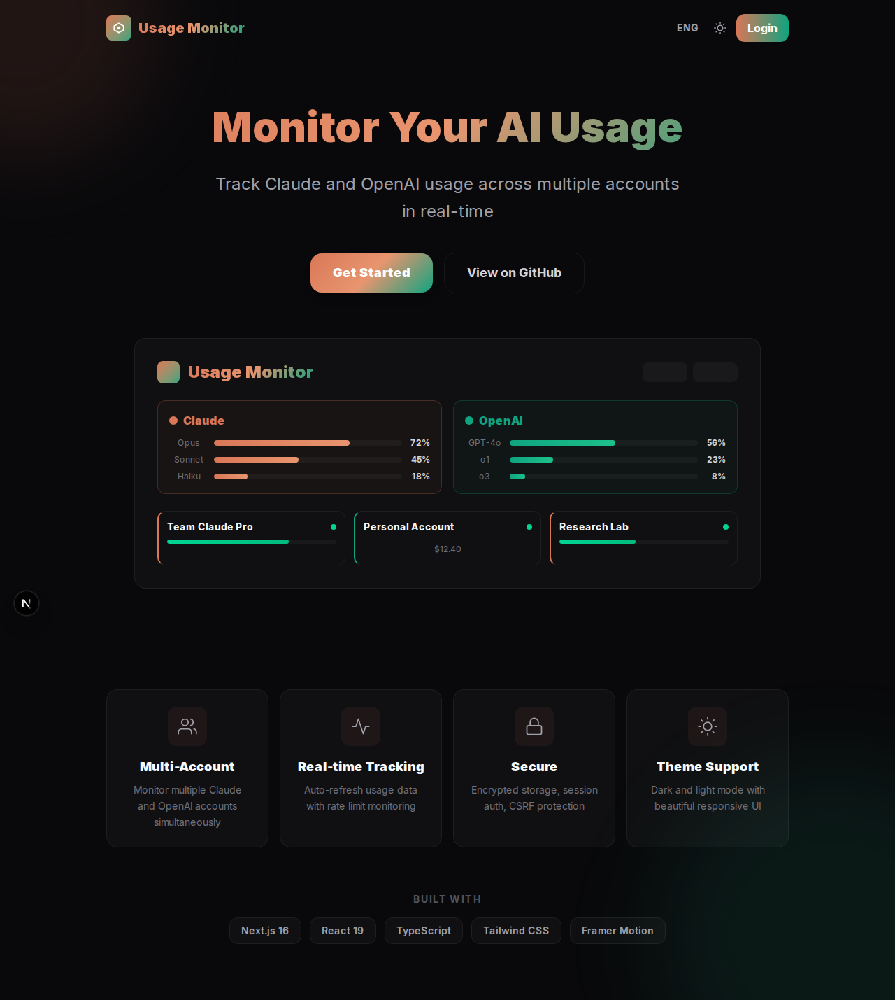
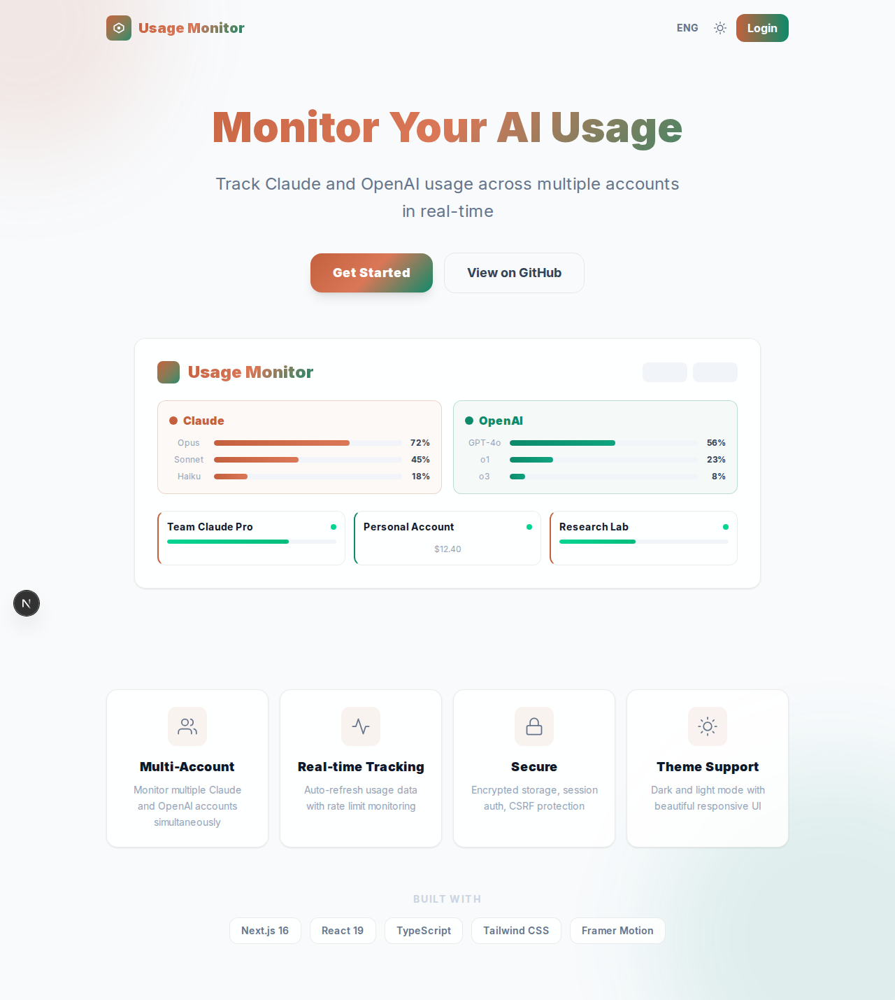
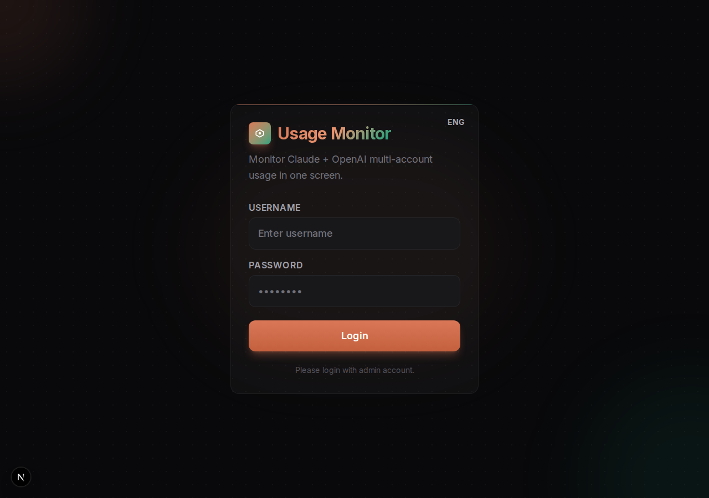
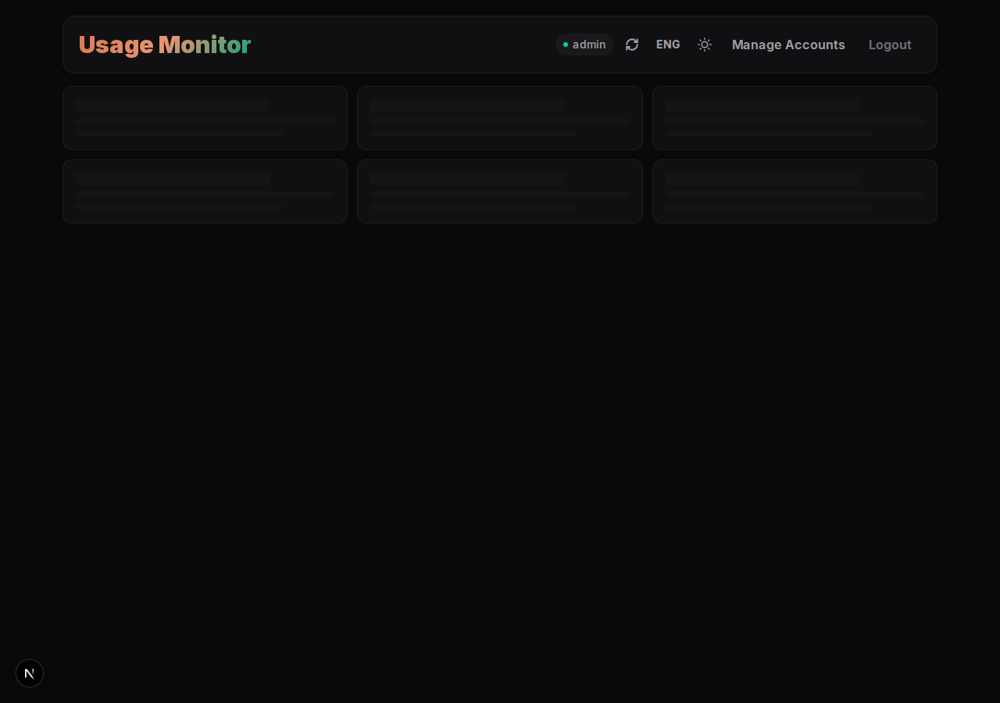
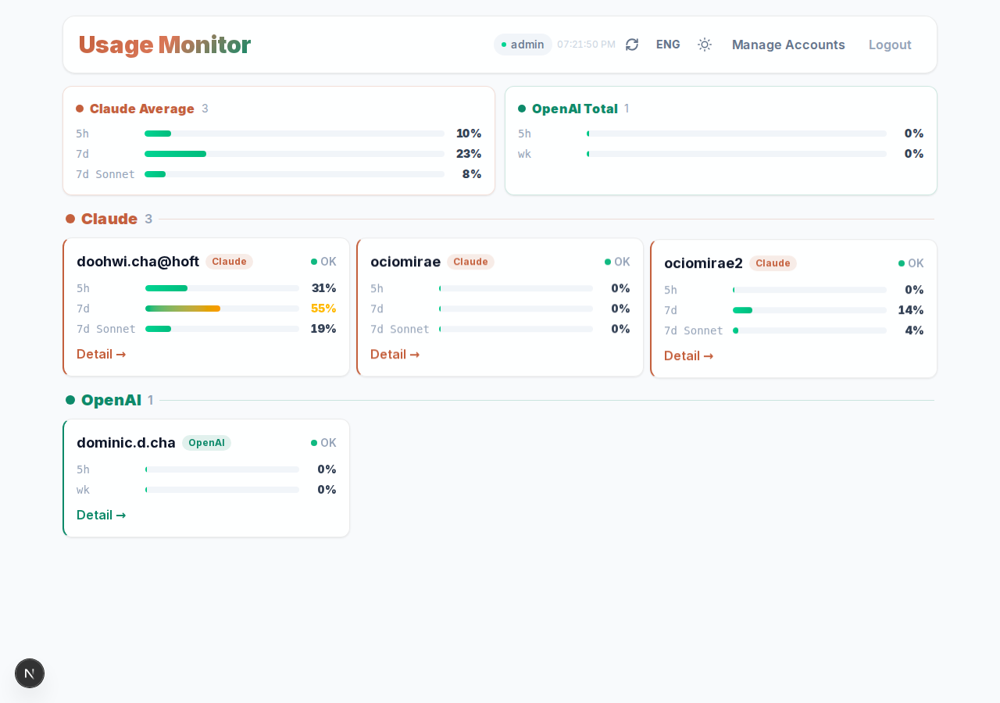
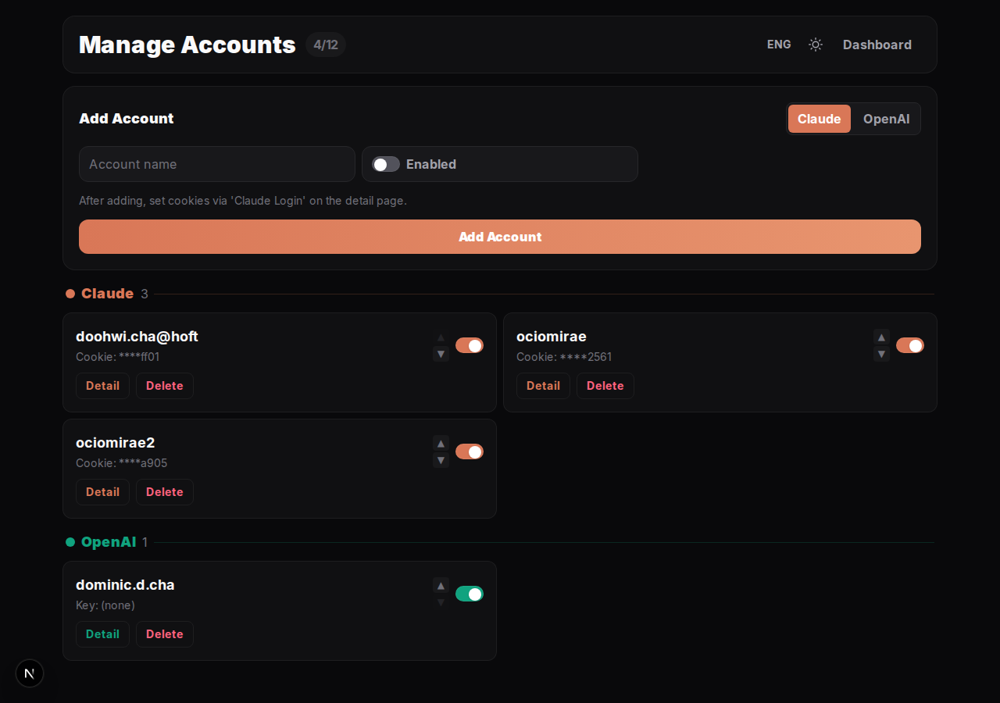
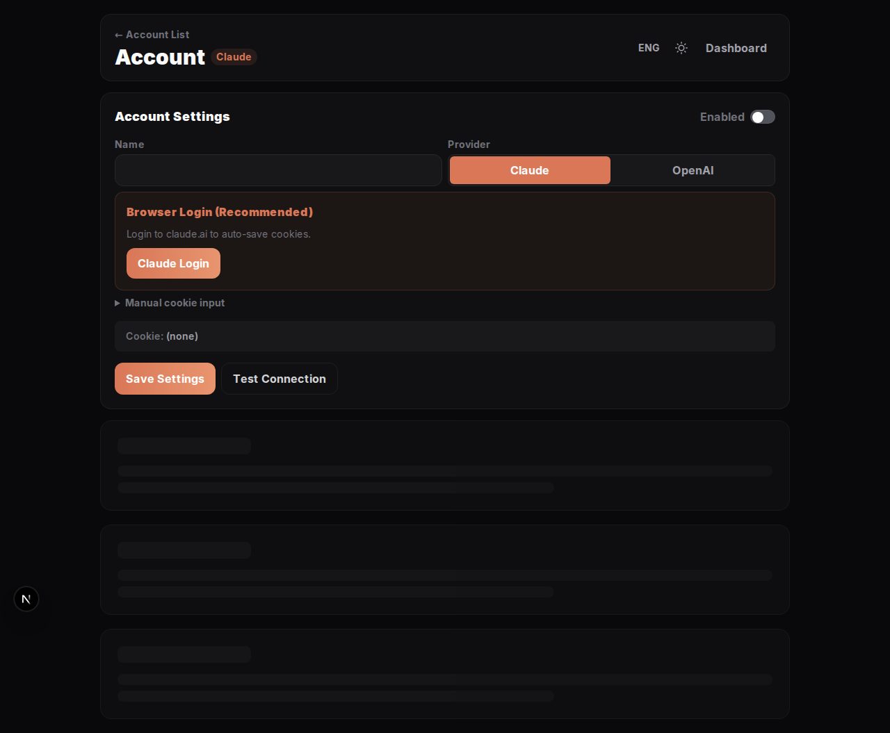
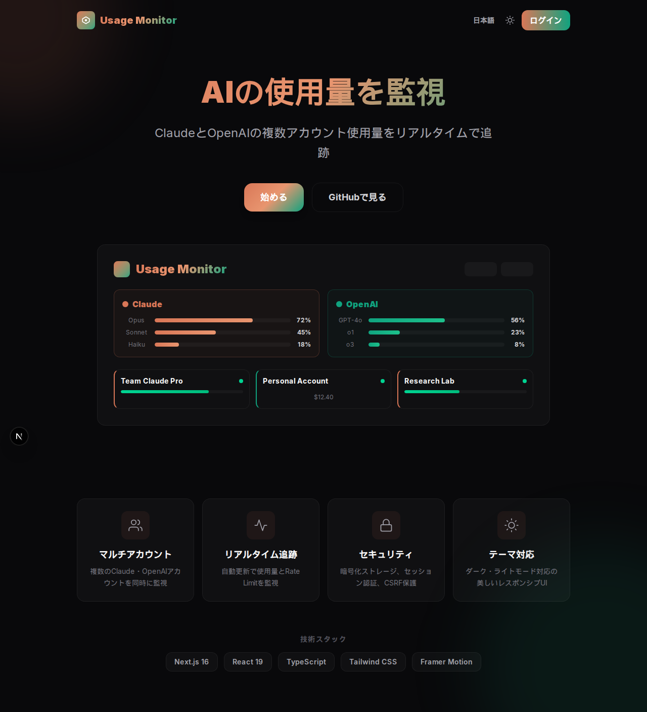

# Usage Monitor

Monitor **Claude** and **OpenAI** multi-account usage in a single dashboard.

Built with Next.js 16, React 19, TypeScript, Tailwind CSS v4, and Framer Motion.



---

## Features

- **Multi-Account Support** — Monitor up to 12 Claude and OpenAI accounts simultaneously
- **Real-time Usage Tracking** — Auto-refresh every 60 seconds with background updates
- **Rate Limit Monitoring** — Visualize Claude usage windows (5h, 7d) with progress bars
- **Local Sync** — Run browser login on your own GUI machine, then upload Claude cookies to the remote dashboard
- **Multi-User Auth** — Scrypt-hashed passwords, role-based access (admin/viewer), server-side sessions
- **Dark / Light Theme** — Beautiful glass-morphism UI with theme toggle
- **6 Languages** — English, Korean, Japanese, Chinese, Spanish, Portuguese
- **Secure** — AES-256-GCM encryption, SQLite-backed sessions, CSRF protection, CSP headers, audit logging

---

## Screenshots

### Landing Page

Service introduction with dashboard preview mockup.

| Dark | Light |
|------|-------|
|  |  |

### Login

Admin authentication with gradient brand styling.



### Dashboard

Real-time usage overview with provider grouping and utilization bars.

| Dark | Light |
|------|-------|
|  |  |

### Account Management

Add, reorder, enable/disable, and delete accounts.



### Account Detail

Per-account settings, local sync, connection testing, and daily usage table.



### Internationalization

All UI text is translated. Example in Japanese:



---

## Getting Started

### Prerequisites

- **Node.js** 20+
- **npm** 10+
- (Optional) **Playwright** on the operator's local GUI machine for local sync

### Installation

```bash
git clone https://github.com/DoohwiCha/usage-monitor.git
cd usage-monitor
npm install
```

### Environment Variables

Copy the example file and configure:

```bash
cp .env.example .env.local
```

| Variable | Description | Required |
|----------|-------------|----------|
| `MONITOR_ADMIN_USER` | Initial admin username | **Yes** |
| `MONITOR_ADMIN_PASS` | Initial admin password (min 8 chars) | **Yes** |
| `MONITOR_ENCRYPTION_KEY` | 64-char hex key for AES-256-GCM (use `openssl rand -hex 32`) | **Yes** |
| `MONITOR_DB_PATH` | Override SQLite database file path (advanced / test) | No |
| `MONITOR_BROWSER_PROFILE_ROOT` | Override persistent Playwright browser-profile root used by legacy/server-side browser flows | No |
| `MONITOR_COOKIE_SECURE` | Override login cookie `secure` flag: `true` or `false` (default: auto by request protocol) | No |
| `TRUST_PROXY` | Trust proxy IP headers for login rate-limit key (`true` to enable) | No |
| `TRUST_PROXY_SHARED_SECRET` | Shared secret required to trust forwarded IP headers (`x-monitor-proxy-secret`) | No (recommended with `TRUST_PROXY=true`) |
| `LOG_LEVEL` | Logging level: `debug`, `info`, `warn`, `error` | No (default: `info` in production) |

Generate secrets:

```bash
openssl rand -hex 32  # for MONITOR_ENCRYPTION_KEY
```

> **Note**: There are no default credentials. All environment variables must be set explicitly.

### Running on Another PC (Troubleshooting)

- If you moved `data/usage-monitor.db` to another machine, reuse the same `MONITOR_ENCRYPTION_KEY` value from the original machine. A different key cannot decrypt saved secrets.
- If usage or connection checks return an encryption-key mismatch error, set the original `MONITOR_ENCRYPTION_KEY` and restart the server.
- Browser login profiles are stored outside the project tree by default under `~/.usage-monitor/browser-profiles`. Override with `MONITOR_BROWSER_PROFILE_ROOT` if needed for legacy/server-side automation only; the new local sync helper uses a profile directory on the operator's machine.
- To move the SQLite database, set `MONITOR_DB_PATH` to the target file path before starting the server.
- Login session cookie `secure` now follows request protocol automatically (`https` => secure, `http` => non-secure).
- If reverse proxy/TLS setup needs explicit behavior, set `MONITOR_COOKIE_SECURE=true` or `MONITOR_COOKIE_SECURE=false`.
- If you run behind a reverse proxy/CDN, set `TRUST_PROXY=true`.
- For forwarded IP trust, also set `TRUST_PROXY_SHARED_SECRET` and configure your proxy to send `x-monitor-proxy-secret` with the same value.

### Run

```bash
# Development
npm run dev

# Production
npm run build
npm start
```

Open [http://localhost:3000](http://localhost:3000)

### Migrate from JSON (if upgrading)

If you have an existing `data/usage-monitor.json` from a previous version:

```bash
npx tsx scripts/migrate-json-to-sqlite.ts
```

This migration only imports Claude cookie-based accounts. Unsupported legacy OpenAI JSON rows are skipped.

### Claude Local Sync

Use the local sync helper from your own GUI machine, not from the headless Mac mini or an SSH shell attached to it.

```bash
npx playwright install chromium
npx tsx scripts/local-sync.ts claude --server https://usage-monitor.hjyeo.com --account-id <account-id>
```

- The helper opens a local browser, waits for you to log in, then prompts for the sync token shown in the usage-monitor UI before uploading the Claude session cookie.
- **Claude** local sync saves session cookies used for Claude usage collection.
- OpenAI / Codex monitoring now uses CLIProxyAPI auth-store import instead of browser login, local metrics upload, or API-key setup.

### Recommended production model

For this deployment, the recommended long-term operating model is:

- **Claude** → `manual_cookie`
  - Sign in to `claude.ai` in a normal browser
  - Complete Cloudflare verification there
  - Paste the cookie header into usage-monitor
- **OpenAI / Codex** → `CLIProxyAPI auth store`
  - Import server-local `~/.cli-proxy-api/codex-*.json` accounts
  - usage-monitor reads those auth files directly on the Mac mini server

This split is intentional:

- Claude auth-store access works, but the upstream OAuth usage endpoint can be rate-limited more aggressively during interactive dashboard use.
- Codex/OpenAI auth-store access is the best multi-account source on this server because it is truly account-scoped.

### CLIProxyAPI auth store import (recommended for Codex multi-account)

On this server, usage-monitor can read account files directly from the local CLIProxyAPI auth store:

- Default auth store path: `~/.cli-proxy-api`
- OpenAI / Codex files: `codex-*.json`
- Claude files: `claude-*.json`

This is the recommended path for **Codex multi-account monitoring** because it keeps all account credentials and usage collection on the same Mac mini server.

How it works:

1. usage-monitor scans `~/.cli-proxy-api`
2. The Accounts page shows detected CLIProxyAPI auth-store accounts
3. Click **Import** to create a file-backed usage-monitor account
4. usage-monitor reads that auth file on demand and fetches usage directly from the provider

Notes:

- For **OpenAI / Codex**, usage-monitor uses the auth file's `access_token` + `account_id` to call ChatGPT/Codex usage endpoints directly.
- For **Claude**, usage-monitor can also read `claude-*.json` auth files directly, but the recommended production path remains the manual cookie flow for better operational stability.
- Auth-store imports do **not** copy the access token into the usage-monitor DB. The DB stores only the source metadata (file path, identity, expiry, etc.), and usage-monitor reads the file when needed.

### Claude Manual Cookie Fallback

If Claude local sync gets stuck on Cloudflare security verification, use the manual cookie fallback instead.

1. Open your normal Chrome or Edge browser and sign in to `https://claude.ai` directly.
2. Complete any Cloudflare verification in the normal browser first.
3. Open DevTools (`F12`) → **Application** → **Storage** → **Cookies** → `https://claude.ai`.
4. Build a cookie header string in this format:

```text
name1=value1; name2=value2; name3=value3
```

Start with these cookies:

- `sessionKey`
- `cf_clearance`
- `lastActiveOrg`

If the first attempt does not connect, add these too:

- `routingHint`
- `activitySessionId`
- `anthropic-device-id`

5. In usage-monitor, open the target Claude account detail page.
6. Expand **Manual cookie input**.
7. Paste the cookie header string.
8. Click **Save Settings**.
9. Click **Test Connection**.

Notes:

- `sessionKey` is the Claude session itself.
- `cf_clearance` is usually required after Cloudflare verification.
- Prefer cookies from `.claude.ai` / `claude.ai`. You usually do not need unrelated analytics cookies.
- Treat the pasted cookie string like a password. Rotate or refresh the Claude session if you exposed it anywhere unsafe.

### Run Tests

```bash
npm test
```

---

## Architecture

```
usage-monitor/
├── app/                        # Next.js App Router
│   ├── page.tsx                # Landing page
│   ├── layout.tsx              # Root layout (LocaleProvider, ErrorBoundary)
│   ├── monitor/
│   │   ├── page.tsx            # Dashboard
│   │   ├── login/page.tsx      # Login page
│   │   └── accounts/
│   │       ├── page.tsx        # Account manager
│   │       └── [id]/page.tsx   # Account detail
│   └── api/monitor/            # REST API routes
│       ├── auth/               # Login, logout, session check
│       ├── accounts/           # CRUD + reorder + connect test
│       └── usage/              # Usage data aggregation
├── components/monitor/         # UI components
│   ├── MonitorDashboard.tsx    # Main dashboard
│   ├── AccountsManager.tsx     # Account list & add form
│   ├── AccountDetail.tsx       # Per-account settings & usage
│   ├── LoginForm.tsx           # Login form
│   ├── shared.tsx              # ToggleSwitch, Spinner, brandVar
│   ├── ErrorBoundary.tsx       # React error boundary
│   ├── ThemeToggle.tsx         # Dark/light toggle
│   └── LanguageSelector.tsx    # i18n language picker
├── lib/
│   ├── i18n/                   # Internationalization
│   │   ├── translations.ts     # 6 languages, type-safe keys
│   │   └── context.tsx         # React context + useTranslation
│   └── usage-monitor/
│       ├── types.ts            # TypeScript types
│       ├── db.ts               # SQLite initialization + migrations
│       ├── store.ts            # Account CRUD (SQLite-backed)
│       ├── users.ts            # Multi-user management + scrypt hashing
│       ├── sessions.ts         # Server-side session management
│       ├── auth.ts             # Auth orchestration (login, logout, validate)
│       ├── api-auth.ts         # API route auth + CSRF
│       ├── server-auth.ts      # Server component auth
│       ├── rate-limiter.ts     # SQLite-backed sliding window rate limiter
│       ├── browser-pool.ts     # Playwright concurrency control (max 3)
│       ├── browser-profile-path.ts # Persistent browser profile path helpers
│       ├── usage-cache.ts      # In-memory usage result cache (3min TTL)
│       ├── usage-adapters.ts   # Claude/OpenAI API adapters
│       ├── range.ts            # Date range utilities
│       ├── logger.ts           # Structured JSON logger
│       ├── audit.ts            # Audit log (SQLite)
│       └── response.ts         # Secure JSON response helper
├── __tests__/                  # Unit tests (Vitest)
│   ├── setup.ts                # Test environment setup
│   ├── users.test.ts           # User management tests
│   ├── sessions.test.ts        # Session management tests
│   ├── store.test.ts           # Account store tests
│   ├── rate-limiter.test.ts    # Rate limiter tests
│   └── range.test.ts           # Date range tests
├── scripts/
│   └── migrate-json-to-sqlite.ts  # JSON → SQLite migration
├── proxy.ts                    # Edge auth proxy
├── data/                       # SQLite database (gitignored)
└── docs/screenshots/           # App screenshots
```

---

## Security

| Feature | Implementation |
|---------|---------------|
| Authentication | Multi-user with scrypt password hashing |
| Sessions | Server-side SQLite sessions (12h TTL) with revocation support |
| Rate Limiting | SQLite-backed sliding window (5 login attempts / 15 min) |
| Encryption | AES-256-GCM for stored secrets (cookies, auth metadata) |
| CSRF | Origin + Referer header validation (deny when absent) |
| Headers | CSP, HSTS, X-Frame-Options DENY, X-Content-Type nosniff, no-cache on API |
| Browser Pool | Max 2 concurrent Playwright instances to prevent resource exhaustion |
| Audit Log | All security events logged to SQLite (login, account CRUD, session extraction) |
| Secrets in API | Masked in all responses (`****` + last 4 chars) |

---

## Supported Providers

| Provider | Auth Method | Data Source |
|----------|------------|-------------|
| **Claude** | Local helper sync on your GUI machine or manual cookie fallback | claude.ai internal API (rate limits, utilization) |
| **OpenAI** | CLIProxyAPI Codex auth-store import | ChatGPT/Codex usage windows (`5h`, `7d`) via account-scoped auth files |

---

## Tech Stack

- **Framework**: [Next.js 16](https://nextjs.org/) (App Router, Turbopack)
- **UI**: [React 19](https://react.dev/), [Tailwind CSS v4](https://tailwindcss.com/), [Framer Motion](https://www.framer.com/motion/)
- **Language**: [TypeScript 5](https://www.typescriptlang.org/) (strict mode)
- **Database**: [SQLite](https://www.sqlite.org/) via [better-sqlite3](https://github.com/WiseLibs/better-sqlite3) (WAL mode)
- **Testing**: [Vitest](https://vitest.dev/) (62 unit tests)
- **Browser Automation**: [Playwright](https://playwright.dev/) (optional)

---

## License

MIT
